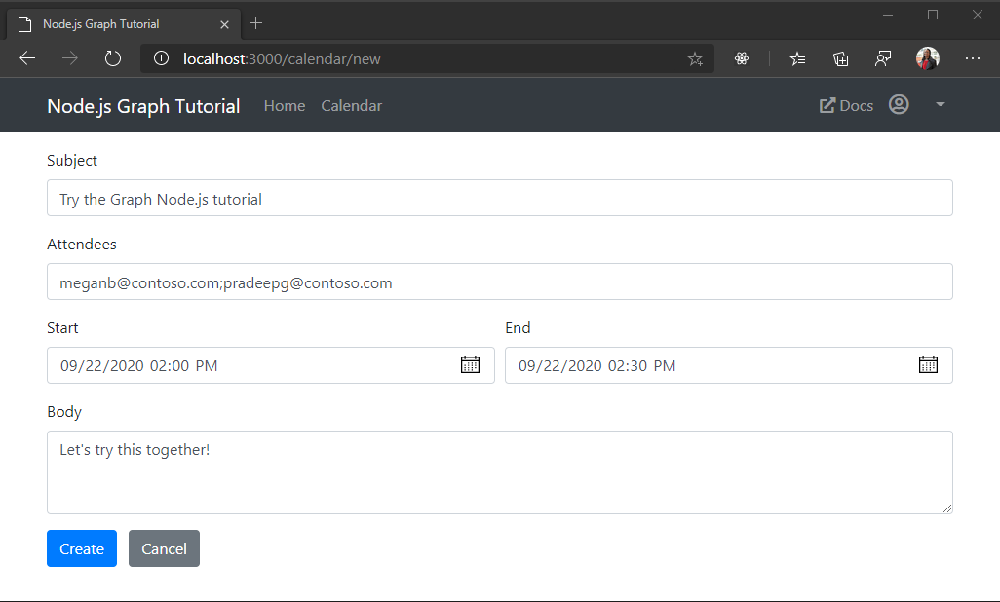

<!-- markdownlint-disable MD002 MD041 -->

このセクションでは、ユーザーの予定表にイベントを作成する機能を追加します。

## 新しいイベントフォームを作成する

1. **Newevent** という名前の新しいファイルを作成し、次のコードを追加し **ます。**

    :::code language="html" source="../demo/graph-tutorial/views/newevent.hbs" id="NewEventFormSnippet":::

1. 行の前に、次のコードを **/routes/calendar.js** ファイルに追加します。 `module.exports = router;`

    :::code language="javascript" source="../demo/graph-tutorial/routes/calendar.js" id="GetEventFormSnippet":::

これにより、ユーザー入力用のフォームが実装され、レンダリングされます。

## イベントを作成する

1. **/graph.js** を開き、に次の関数を追加 `module.exports` します。

    :::code language="javascript" source="../demo/graph-tutorial/graph.js" id="CreateEventSnippet":::

    このコードでは、フォームフィールドを使用して Graph イベントオブジェクトを作成し、エンドポイントに POST 要求を送信して、 `/me/events` ユーザーの既定の予定表にイベントを作成します。

1. 行の前に、次のコードを **/routes/calendar.js** ファイルに追加します。 `module.exports = router;`

    :::code language="javascript" source="../demo/graph-tutorial/routes/calendar.js" id="PostEventFormSnippet":::

    このコードは、フォーム入力を検証して、その後、 `graph.createEvent` イベントを作成するために呼び出します。 呼び出しが完了すると、[予定表] ビューにリダイレクトされます。

1. 変更内容を保存し、アプリを再起動します。 [ **予定表** ] ナビゲーション項目をクリックし、[ **イベントの作成** ] ボタンをクリックします。 値を入力し、[ **作成** ] をクリックします。 新しいイベントが作成されると、アプリは [予定表] ビューに戻ります。

    
