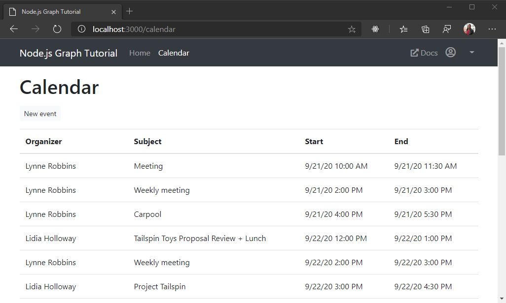

<!-- markdownlint-disable MD002 MD041 -->

<span data-ttu-id="1a619-101">この演習では、Microsoft Graph をアプリケーションに組み込みます。</span><span class="sxs-lookup"><span data-stu-id="1a619-101">In this exercise you will incorporate the Microsoft Graph into the application.</span></span> <span data-ttu-id="1a619-102">このアプリケーションでは、microsoft graph[クライアント](https://github.com/microsoftgraph/msgraph-sdk-javascript)ライブラリを使用して microsoft graph への呼び出しを行います。</span><span class="sxs-lookup"><span data-stu-id="1a619-102">For this application, you will use the [microsoft-graph-client](https://github.com/microsoftgraph/msgraph-sdk-javascript) library to make calls to Microsoft Graph.</span></span>

## <a name="get-calendar-events-from-outlook"></a><span data-ttu-id="1a619-103">Outlook から予定表のイベントを取得する</span><span class="sxs-lookup"><span data-stu-id="1a619-103">Get calendar events from Outlook</span></span>

<span data-ttu-id="1a619-104">最初に、新しいメソッドを`./graph.js`ファイルに追加して、予定表からイベントを取得します。</span><span class="sxs-lookup"><span data-stu-id="1a619-104">Start by adding a new method to the `./graph.js` file to get the events from the calendar.</span></span> <span data-ttu-id="1a619-105">の内`module.exports`に`./graph.js`次の関数を追加します。</span><span class="sxs-lookup"><span data-stu-id="1a619-105">Add the following function inside the `module.exports` in `./graph.js`.</span></span>

```js
getEvents: async function(accessToken) {
  const client = getAuthenticatedClient(accessToken);

  const events = await client
    .api('/me/events')
    .select('subject,organizer,start,end')
    .orderby('createdDateTime DESC')
    .get();

  return events;
}
```

<span data-ttu-id="1a619-106">このコードの内容を検討してください。</span><span class="sxs-lookup"><span data-stu-id="1a619-106">Consider what this code is doing.</span></span>

- <span data-ttu-id="1a619-107">呼び出し先の URL は`/me/events`になります。</span><span class="sxs-lookup"><span data-stu-id="1a619-107">The URL that will be called is `/me/events`.</span></span>
- <span data-ttu-id="1a619-108">この`select`メソッドは、各イベントに対して返されるフィールドを、ビューが実際に使用するものだけに制限します。</span><span class="sxs-lookup"><span data-stu-id="1a619-108">The `select` method limits the fields returned for each events to just those the view will actually use.</span></span>
- <span data-ttu-id="1a619-109">メソッド`orderby`は、生成された日付と時刻で結果を並べ替えます。最新のアイテムが最初に表示されます。</span><span class="sxs-lookup"><span data-stu-id="1a619-109">The `orderby` method sorts the results by the date and time they were created, with the most recent item being first.</span></span>

<span data-ttu-id="1a619-110">という名前`./routes` `calendar.js`のディレクトリに新しいファイルを作成し、次のコードを追加します。</span><span class="sxs-lookup"><span data-stu-id="1a619-110">Create a new file in the `./routes` directory named `calendar.js`, and add the following code.</span></span>

```js
var express = require('express');
var router = express.Router();
var tokens = require('../tokens.js');
var graph = require('../graph.js');

/* GET /calendar */
router.get('/',
  async function(req, res) {
    if (!req.isAuthenticated()) {
      // Redirect unauthenticated requests to home page
      res.redirect('/')
    } else {
      let params = {
        active: { calendar: true }
      };

      // Get the access token
      var accessToken;
      try {
        accessToken = await tokens.getAccessToken(req);
      } catch (err) {
        res.json(err);
      }

      if (accessToken && accessToken.length > 0) {
        try {
          // Get the events
          var events = await graph.getEvents(accessToken);

          res.json(events.value);
        } catch (err) {
          res.json(err);
        }
      }
    }
  }
);

module.exports = router;
```

<span data-ttu-id="1a619-111">この`./app.js`新しいルートを使用するように更新します。</span><span class="sxs-lookup"><span data-stu-id="1a619-111">Update `./app.js` to use this new route.</span></span> <span data-ttu-id="1a619-112">行の`var app = express();` **前に**次の行を追加します。</span><span class="sxs-lookup"><span data-stu-id="1a619-112">Add the following line **before** the `var app = express();` line.</span></span>

```js
var calendarRouter = require('./routes/calendar');
```

<span data-ttu-id="1a619-113">その後、行`app.use('/auth', authRouter);`の**後**に次の行を追加します。</span><span class="sxs-lookup"><span data-stu-id="1a619-113">Then add the following line **after** the `app.use('/auth', authRouter);` line.</span></span>

```js
app.use('/calendar', calendarRouter);
```

<span data-ttu-id="1a619-114">これで、これをテストできます。</span><span class="sxs-lookup"><span data-stu-id="1a619-114">Now you can test this.</span></span> <span data-ttu-id="1a619-115">サインインして、ナビゲーションバーの [**予定表**] リンクをクリックします。</span><span class="sxs-lookup"><span data-stu-id="1a619-115">Sign in and click the **Calendar** link in the nav bar.</span></span> <span data-ttu-id="1a619-116">すべてが動作する場合は、ユーザーの予定表にイベントの JSON ダンプが表示されます。</span><span class="sxs-lookup"><span data-stu-id="1a619-116">If everything works, you should see a JSON dump of events on the user's calendar.</span></span>

## <a name="display-the-results"></a><span data-ttu-id="1a619-117">結果を表示する</span><span class="sxs-lookup"><span data-stu-id="1a619-117">Display the results</span></span>

<span data-ttu-id="1a619-118">これで、ビューを追加して、よりわかりやすい方法で結果を表示することができます。</span><span class="sxs-lookup"><span data-stu-id="1a619-118">Now you can add a view to display the results in a more user-friendly manner.</span></span> <span data-ttu-id="1a619-119">最初に、行の`./app.js` \*\*\*\* `app.set('view engine', 'hbs');`後に次のコードを追加します。</span><span class="sxs-lookup"><span data-stu-id="1a619-119">First, add the following code in `./app.js` **after** the `app.set('view engine', 'hbs');` line.</span></span>

```js
var hbs = require('hbs');
var moment = require('moment');
// Helper to format date/time sent by Graph
hbs.registerHelper('eventDateTime', function(dateTime){
  return moment(dateTime).format('M/D/YY h:mm A');
});
```

<span data-ttu-id="1a619-120">これにより、Microsoft Graph によって返される ISO 8601 日付をよりわかりやすいものに書式設定する[Handlebars ヘルパー](http://handlebarsjs.com/#helpers)が実装されています。</span><span class="sxs-lookup"><span data-stu-id="1a619-120">This implements a [Handlebars helper](http://handlebarsjs.com/#helpers) to format the ISO 8601 date returned by Microsoft Graph into something more human-friendly.</span></span>

<span data-ttu-id="1a619-121">という名前`./views` `calendar.hbs`のディレクトリに新しいファイルを作成し、次のコードを追加します。</span><span class="sxs-lookup"><span data-stu-id="1a619-121">Create a new file in the `./views` directory named `calendar.hbs` and add the following code.</span></span>

```html
<h1>Calendar</h1>
<table class="table">
  <thead>
    <tr>
      <th scope="col">Organizer</th>
      <th scope="col">Subject</th>
      <th scope="col">Start</th>
      <th scope="col">End</th>
    </tr>
  </thead>
  <tbody>
    {{#each events}}
      <tr>
        <td>{{this.organizer.emailAddress.name}}</td>
        <td>{{this.subject}}</td>
        <td>{{eventDateTime this.start.dateTime}}</td>
        <td>{{eventDateTime this.end.dateTime}}</td>
      </tr>
    {{/each}}
  </tbody>
</table>
```

<span data-ttu-id="1a619-122">これにより、イベントのコレクションをループ処理して、テーブル行を1つずつ追加します。</span><span class="sxs-lookup"><span data-stu-id="1a619-122">That will loop through a collection of events and add a table row for each one.</span></span> <span data-ttu-id="1a619-123">このビューを使用する`./routes/calendar.js`には、のルートを更新します。</span><span class="sxs-lookup"><span data-stu-id="1a619-123">Now update the route in `./routes/calendar.js` to use this view.</span></span> <span data-ttu-id="1a619-124">既存のルートを次のコードに置き換えます。</span><span class="sxs-lookup"><span data-stu-id="1a619-124">Replace the existing route with the following code.</span></span>

```js
router.get('/',
  async function(req, res) {
    if (!req.isAuthenticated()) {
      // Redirect unauthenticated requests to home page
      res.redirect('/')
    } else {
      let params = {
        active: { calendar: true }
      };

      // Get the access token
      var accessToken;
      try {
        accessToken = await tokens.getAccessToken(req);
      } catch (err) {
        req.flash('error_msg', {
          message: 'Could not get access token. Try signing out and signing in again.',
          debug: JSON.stringify(err)
        });
      }

      if (accessToken && accessToken.length > 0) {
        try {
          // Get the events
          var events = await graph.getEvents(accessToken);
          params.events = events.value;
        } catch (err) {
          req.flash('error_msg', {
            message: 'Could not fetch events',
            debug: JSON.stringify(err)
          });
        }
      }

      res.render('calendar', params);
    }
  }
);
```

<span data-ttu-id="1a619-125">変更を保存し、サーバーを再起動して、アプリにサインインします。</span><span class="sxs-lookup"><span data-stu-id="1a619-125">Save your changes, restart the server, and sign in to the app.</span></span> <span data-ttu-id="1a619-126">[**予定表**] リンクをクリックすると、アプリがイベントの表を表示するようになります。</span><span class="sxs-lookup"><span data-stu-id="1a619-126">Click on the **Calendar** link and the app should now render a table of events.</span></span>

